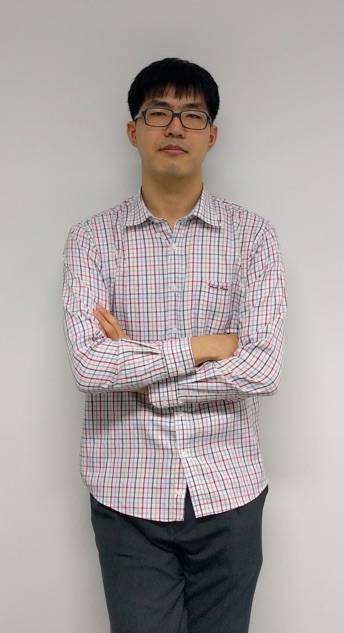

---
title: Kang Seonghoon
lang: en
short: kang
...

An ordinary person.

I have written softwares both for hobby and for work for some two decades,
ranging from low-level system programming to front-end Web and application programming.
Currently I work at [Devcat Studio](http://devcat.nexon.com/),
and hopefully I'm doing something useful there.

Once upon a time I had [academic career](http://plrg.kaist.ac.kr/ksh),
producing [some paper](http://dl.acm.org/citation.cfm?doid=2384616.2384661).
I was a sort of programming language geek at that time; less sure about that now.
PL is still one of my interest and I occasionally deal with them.

More trivia:

- I have about twenty nicknames in use.
I have a rather complicated [guideline](#naming) on names.

- I am a proud preservationist.
I believe that every information shall be preserved unless there are really good causes.
You may see decade-old pages lurking around in this website, for example.

- I am a born-again Christian and accept the King James Bible as the final authority.
I run my own [Holy Bible website](http://bible.mearie.org/) (in Korean).

- I am an avid music video gamer for about 15 years.
I go by the nickname *yurume* in many BEMANI games and others.

- I eat dozen boxes of mandarins and drink about 500 litres of Coke every year.
For what it's worth, let me clarify that
oranges (<i>C. &times; sinensis</i> and other species of <i>Citrus</i> genus) are
not mandarins (<i>C. reticulata</i>).

- I tend to break every computing device in some way within two years of usage.

Well, anyway, welcome and I hope you enjoy your visit.

# Naming {#naming}

The real name **Kang Seonghoon**[^1] is always written in this way:
always capitalized and not CamelCased, given name after surname,
and no hyphens or spaces between given name.
I allow **Kang, Seonghoon** or **Seonghoon Kang**
for the purpose of uniformity and other inevitable situations,
but please minimize their uses.
Other forms are strictly forbidden.

[^1]: Approximately pronounced /kɐŋ.sʌŋ.ɸun/.

I go by some 20 nicknames and at any given moment I use more than a half of them.
The following list is for most used ones and associated services.

- *lifthrasiir* for [Github](https://github.com/lifthrasiir/) and [Reddit](https://www.reddit.com/user/lifthrasiir). Also a primary IRC nickname.
- *arachneng* for [Tumblr](http://arachneng.tumblr.com) and [SoundCloud](https://soundcloud.com/arachneng).
- *senokay* for [Twitter](https://twitter.com/senokay) and other "official" uses.
- *yurume* for most music video games. Also a secondary IRC nickname.

I used to go by *tokigun* as well, which is subsequently obsoleted.
Please do not use this nickname.
All nicknames can be freely capitalized or de-capitalized.

I do *not* use Facebook and many other social-gathering websites.

# Two-dimensional reproduction

  
January 2016.

  
December 2008. Not much discrepancy I think?
(&copy; Kim Joon-gi, [source](https://www.flickr.com/photos/daybreaker12/3011869731/))

# More formally

Please take a look at my [curriculum vitae](/cv) and [contact information](/cont).

